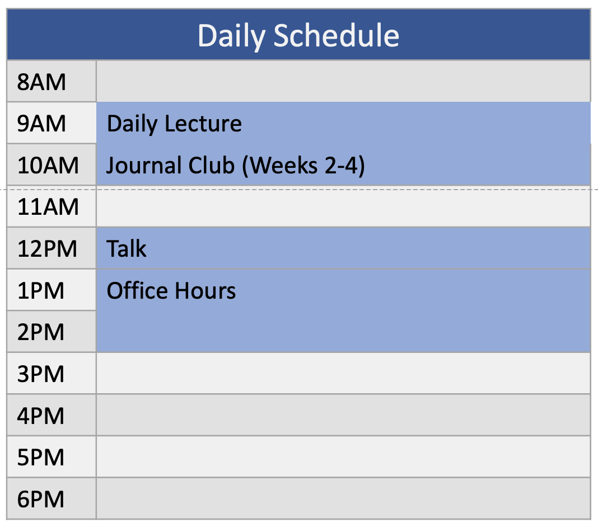

# Coriell Bioinformatics Research Experience 2021

The Bioinformatics Research Experience is a four-week research training program for undergraduate students interested in learning scientific biological data analysis. The previous year's material can be seen here:: [2020](https://coriell-bre.github.io/2020_Bioinformatics_Research_Experience/)

---

## Schedule

 

#### Talks and Lectures

- [Daily Lecture Topics](https://docs.google.com/spreadsheets/d/1NnAIafN6x1MkCAhuXARa-80PsDZWWSrKE3W4T8rdy_U/edit?usp=sharing)
- [Speaker List](https://docs.google.com/spreadsheets/d/1zB7tjQF1Xtp6KgiZ6rR0qtcah-rLtHwZUWlpgb7APEc/edit?usp=sharing)

---

## Getting Started

### Programs to Install

1. Zoom <https://zoom.us/download>
2. Slack <https://slack.com/>. If you're familiar with Slack, our slack name is coriellbioinf-se37156. Otherwise you can follow the attached directions in slack_intructions.pdf.
3. Download and install TeamViewer <https://www.teamviewer.com/en-us/>. This will allow the research experience team to screen share with your computer to assist with technical problems.
4. R. If you don't already have it installed, go to R Cloud <https://cloud.r-project.org/> to download and install R.
5. RStudio. Go to RStudio's website <https://rstudio.com/products/rstudio/download/> and download the FREE version.

---

## BRE Material

#### **July 06:** Welcome and Introduction to Rmarkdown and RStudio

- Introduction to Coriell and Coriell's Bioinformatics Research Experience
- Introduction to Rmarkdown and RStudio
- [slides](R/2021-07-06_introduction_BRE_rmarkdown/2021-07-06_introduction_BRE_rmarkdown.pdf)

 

Today's Assignment: **Rmarkdown Practice** [Rmarkdown](R/2021-07-06_introduction_BRE_rmarkdown/2021-07-06_rmarkdown_assignment.Rmd)<!-- , ANSWER KEY in [Rmarkdown](R/2021-07-06_introduction_BRE_rmarkdown/2021-07-06_rmarkdown_assignment_ANSWERS.Rmd) and [html](R/2021-07-06_introduction_BRE_rmarkdown/2021-07-06_rmarkdown_assignment_ANSWERS.html) -->